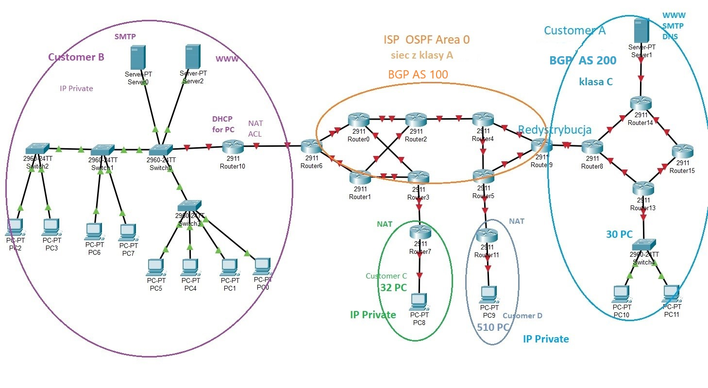

# Sieci komputerowe - Cisco Packet Tracer
Projekt wykonany przez:
Dawid Bania
Adam Egner
Miłosz Wielgus
Adam Suwaj

## Cel projektu
Punktowymi założeniami było wykonanie następujących:

- Adresacja sieci IPv4 z wykorzystaniem najmniejszej liczby adresów IP ✅

- Routing bez BGP (wykorzystaliśmy protokoły RIP/OSPF/NAT/DHCP) ✅

- Przygotowanie przynajmniej 4 sieci VLAN ✅

- Wykorzystanie łącza EtherChannel ✅

- Redystrybucja (RIP<->OSPF) ✅

- Użycie translacji adresów sieciowych NAT dla sieci prywatnych (wersja dynamiczna) ✅

- Zastosowanie protokołu dynamicznego konfigurowania hostów DHCP ✅

- Podłączenie dodatkowych łączy światłowodowych w sieci ISP ✅

- Protokół Access Control List dla serwera WWW i SMTP ✅

- Serwer mailowy w sieci publicznej ✅


## Topologia sieci:
# Wstępny diagram



## Customer A
### Dla sieci `Customer A`:
- Wybrany adres publiczny sieci `201.0.0.0`, należący do klasy C.
- Użyty protokół routingu: `RIPv2`.
- Każdy z PC reprezentuje sieć `30` komputerów. Zaadresowano w nich **ostatni** z komputerów w sieci, tj. `201.0.0.30 255.255.255.192` oraz `201.0.0.61 255.255.255.192`.
- Każde dwa routery połączone ze sobą tworzą podsieć, z użytą `30 bitową` maską (2 bity hosta).

Maski do podsieci wyliczane były w ten sposób, aby liczba hostów do zaadresowania zawierała się w jak najmniejszym zbiorze dostępnych IP. Innymi słowy - zgodnie ze wzorem `2^(host bits) - 2` gdzie dwa adresy są zarezerwowane na `broadcast` oraz `network IP` .
 
### Dla serwera z sieci `Customer A`
W obrębie sieci Customera A podłączony jest również serwer DNS/SMTP. 
- Wybrany adres serwera DNS to `201.0.0.82` `lp.adnorf`
- Wybrana domena mailowa `@lavazza.java`

### Przykładowa konfiguracja:
#### Router 15
```
router rip
    version 2
    network 201.0.0.0
```
#### PC 30
```
IPv4 201.0.0.30
Subnet Mask 255.255.255.192
Default Gateway 201.0.0.62
DNS Server 201.0.0.82
```

## ISP OSPF Area 0
### Dla sieci `ISP OSPF`

- Wybrany adres publiczny sieci `100.0.0.0`, należący do klasy A.
- Wybrany protokół routingu: `OSPF`.
- Pomiędzy wybranymi routerami dołożono dodatkowe okablowanie w postaci łączy światłowodowych (np. pomiędzy `Router4` a `Router3`).
- Każde dwa routery połączone ze sobą tworzą podsieć, z użytą `30 bitową` maską (2 bity hosta).
- Pomiędzy sieciami `Customer A`, `ISP OSPF Area 0` wykorzystano redystrybucję `OSPF<->RIP`

### Przykładowa konfiguracja:
#### Router 9
```
router ospf 1
    network 100.0.0.0 0.0.0.3 area 0
    network 100.0.0.8 0.0.0.3 area 0
    redistribute rip subnets
```
``` 
router rip
    version 2
    redistribute ospf 1 metric 12
    network 201.0.0.0
```

#### Router 2
```
router ospf 1
    network 100.0.0.12 0.0.0.3 area 0
    network 100.0.0.24 0.0.0.3 area 0
    network 100.0.0.28 0.0.0.3 area 0
    network 100.0.0.40 0.0.0.3 area 0
    network 100.0.0.44 0.0.0.3 area 0
```

## Customer C oraz Customer D
### Dla sieci `Customer C`
- Wybrany adres prywatny sieci `192.168.1.0`.
- Do sieci miało należeć `32 PC`. Przy uwzględnieniu `Routera 7` daje nam to 33 hostów - więc wykorzystano maskę `/26`
- Zaadresowano ostatni komputer z tej sieci, z przypisanym adresem `192.168.1.33 255.255.255.192`
- Wykorzystano dynamiczny protokół routingu `NAT`.

### Przykładowa konfiguracja:
#### Router 7
```
interface GigabitEthernet0/0
    ip nat outside
interface GigabitEthernet0/1
    ip nat inside

ip nat pool POOL 100.0.0.62 100.0.0.62 netmask 255.255.255.252
ip nat inside source list 10 pool POOL overload

access-list 10 permit 192.168.1.0 0.0.0.63
```

Dla możliwości komunikacji z siecią `ISP OSPF` oraz `Customer A` dodano statyczny routing:
```
ip route 201.0.0.0 255.0.0.0 100.0.0.61
ip route 100.0.0.0 255.0.0.0 100.0.0.61
```

#### PC 8
```
IPv4 192.168.1.33
Subnet Mask 255.255.255.192
Default Gateway 192.168.1.1
DNS Server 201.0.0.82
```

### Dla sieci `Customer D`
Konfiguracja przebiegła analogicznie jak dla sieci `Customer C` z tym założeniem, że do sieci miało należeć `510 PC`. 
<br><br>
Przy uwzględnieniu `Routera 11` daje nam to 511 hostów - więc wykorzystano maskę `/22`


## Customer B
### Dla sieci `Customer B`
- Wykorzystano protokół `DHCP` do konfigurowania hostów.
- Dobrano alokacje `VLAN'ów`, które przedstawiają się następująco:
1. `VLAN zlotabrama` `192.168.10.0`
2. `VLAN dzuniperek` `192.168.20.0`
3. `VLAN nurek` `192.168.30.0`
4. `VLAN ruterek` `192.168.40.0`
- Dla każdej z podsieci wykorzystano maskę `/29`
- Pomiędzy dwoma switchami, `Switch 0` oraz `Switch 3` wykorzystano `EtherChannel` do połączenia tych łączy fizycznych w jedno logiczne.

### Dla serwerów z sieci `Customer B`
W obrębie sieci Customera B podłączone są również serwery `WWW` oraz `SMTP`.

- Wybrany adres serwera `SMTP` to `192.168.20.2` `nescafe.cpp`
- Wybrany adres serwera `WWW` to `192.168.20.3` 

### Przykładowa konfiguracja:

#### Switch 3

#### Switch 4

#### Server 0

#### Server 2

#### Router 10

#### PC 7
 
